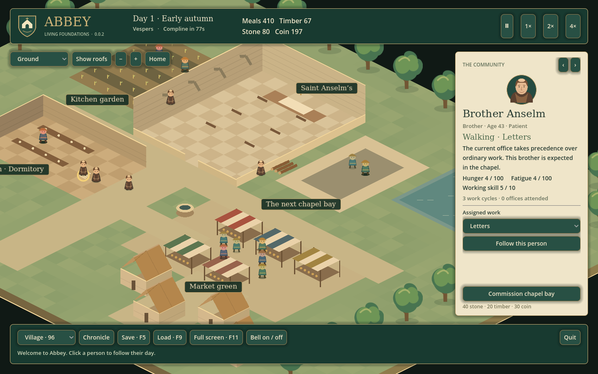

# Abbey — Living Foundations

**0.0.2 · Native feasibility prototype**

A small abbey, a community with somewhere to be, and the first stone bay waiting to be built. This milestone puts a portable **C++20 simulation** behind a **Godot 4.4.1 desktop client**. The simulation builds and runs without Godot; the client provides the isometric view, camera, sound and interface.



This is an early, interactive foundation for the game described in [the founding design](Abbey-Game-Design.md). The larger **0.1.0 “First Bell”** scenario is still ahead.

## Try it

Open the latest successful **Native desktop builds** run in [GitHub Actions](https://github.com/AbbyUsesAIThatCodes/Abbey/actions/workflows/native.yml). Download the artifact for Windows or Linux, unzip the artifact, then unzip the Abbey package inside it. Keep the executable and its accompanying native library together.

- **Windows x64:** launch `Abbey.exe`.
- **Linux x64 (Ubuntu 24.04 or compatible):** launch `Start-Abbey.sh` (or `chmod +x Abbey.x86_64` and run it).

The packaged game needs no editor, browser, Python or compiler. These development builds are unsigned. macOS packages are not provided in this milestone.

Abbey starts full screen. **F11** switches to a window; **Space** pauses. Click a person, change a brother's work, and commission the chapel bay. The floor menu reveals the cellar and upstairs rooms. [Player guide and controls →](docs/Player-Guide.md)

## What is working

- Pan and zoom across a small isometric settlement; hide roofs and switch among three floors.
- Individually identified residents walking to work, meals and rest; monks respond to all eight office bells.
- Inspect name, age, trait, activity, reason, needs, work skill and accumulated work/prayer counters. Assign ordinary work to monks; villagers manage their existing routine.
- Simple grain, meals, timber and trading counters; commission one fixed chapel bay and watch on-site masons advance it.
- Pause, 1×/2×/4× time, a short chronicle, manual save/load, an autosave and one previous-save backup.
- Switch among 8, 96, 500, 2,000 and 5,000 residents for inspection and stress testing.

The full character and economy models are **not** implemented. There are no relationships, memories, aging, illness, hauling, inventories, wages, workstation reservations, crowd collision, free building placement or modular cathedral editor. Most traits are descriptive; Energetic affects walking speed. Several people can occupy the same position. The shared portrait is a placeholder. The map, schedules and recipes are code-defined at this stage. [Scope, architecture and remaining risks →](docs/Architecture.md)

## Build from source

Requirements: Git, Python 3.10+, CMake 3.22+, and a C++20 compiler. Windows: install Visual Studio 2022 Build Tools with **Desktop development with C++**. Linux: GCC 12+ or a recent Clang, plus development/build tools. A graphical session and compatible OpenGL drivers are needed to play; tests can run headlessly.

```sh
# Core only: no Godot dependency or downloads.
python scripts/build.py

# Desktop: build, test, download pinned official Godot tools, and export a package.
python scripts/build.py --desktop --package
```

The first desktop build downloads `godot-cpp`, the Godot editor and export templates. It may take several minutes and downloads a large template archive. Build products stay in ignored `build/`, `.cache/`, `godot/bin/` and `dist/` directories.

To use existing Godot 4.4.1 tools:

```sh
python scripts/build.py --desktop --package --godot /path/to/Godot --templates /path/to/templates
```

After building the extension, open `godot/project.godot` in **Godot 4.4.1** and press F6/F5, or run the project using that editor's command line. Both editor and binding version are deliberately pinned for reproducibility; this is not a claim that 4.4.1 is the newest version.

```sh
cmake -S . -B build -DCMAKE_BUILD_TYPE=Release
cmake --build build --config Release --parallel 4
ctest --test-dir build -C Release --output-on-failure
./build/abbey_benchmark
# Windows multi-config equivalent: build/Release/abbey_benchmark.exe
```

[Measured benchmark and validation notes](docs/Validation.md) explain what the numbers do and do not establish. [Third-party notices](THIRD_PARTY.md) accompany each package.
