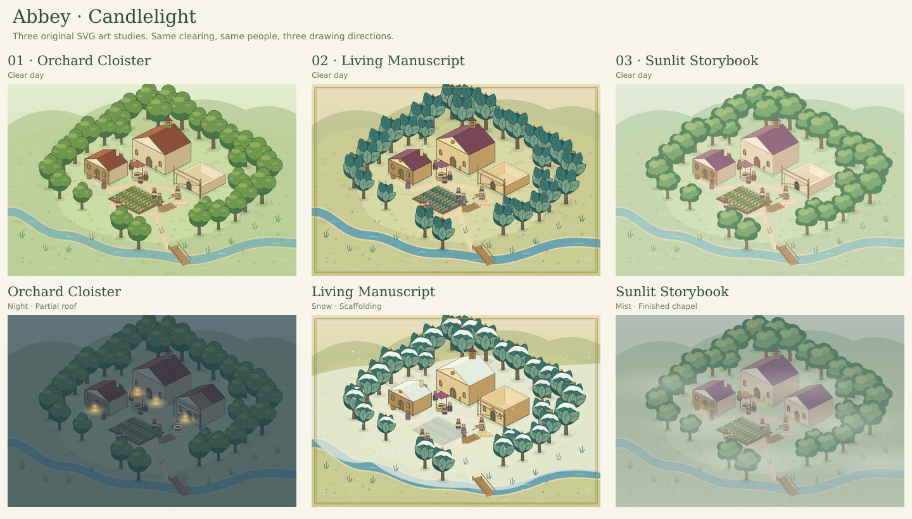

# Abbey · Candlelight 0.0.1

Three small animated SVG art studies for a game about the people who build a great abbey.

**This is the visual-study stage.** The people follow scripted routines, construction can be scrubbed through six stages, and event choices demonstrate writing and illustration. There is no settlement economy or saved game yet.

## Open the preview

On Windows, double-click **Start-Candlelight.bat**, or open **Candlelight.html** directly in a current Edge, Chrome, or Firefox browser.

The preview runs offline and does not require Python, Node, installation, an account, or a local server. Download the file or fetch the repository before opening it; GitHub's source viewer does not run the HTML.

If reviewing this work before it is merged, use branch **feature/candlelight-art-studies**.

## Compare the art

| Direction | What changes |
| --- | --- |
| 01 · Orchard Cloister | Rounded tree clusters, warm limestone, terracotta roofs, clear contours |
| 02 · Living Manuscript | Leaf-shaped trees and veins, patterned roofs, jewel colors, inked details and a gilded frame |
| 03 · Sunlit Storybook | Cloudlike foliage, softer outlines, lavender roofs, broad highlights |

Each direction uses the same site plan, random seed, character paths, construction stages, light, and weather. Changing styles preserves the current moment.

Use **Compare all three** for a synchronized overview, then return to a single study to inspect details.

- Choose dawn, day, dusk, or night, or let the light cycle.
- Switch between clear skies, rain, mist, and snow.
- Scrub construction from survey pegs through foundations, walls, scaffolding, roof work, and completion.
- Call the brothers to Vespers. They gather for twelve seconds, keep twelve seconds of quiet, then return over twelve seconds.
- Select a brother on the map or in the character selector. Foreground foliage fades when it obscures the selected brother.
- Open the illustrated event and try its sample responses.
- Drag to pan, use the zoom controls, or use arrow keys while a form control is not focused. Space pauses when focus is outside a control.
- **Still scene / reduced motion** freezes movement while retaining the light, weather, and construction controls.
- **Save this frame** exports a standalone, editable SVG of the selected art direction.

[View the rendered Vespers animation](docs/captures/vespers.mp4). This twelve-second sample renders the actual SVG routine at 3×; it is not a browser recording or performance benchmark.

## Verification and limits

Ten automated checks pass in a deterministic DOM fixture. They execute the actual study scripts and check state-preserving style changes, synchronized figures, lighting/weather/construction markup, pause and reduced motion, the complete Vespers cycle, character and event controls, SVG export, stress-scene counts, and bounded zoom.

The SVG scenes were rendered directly and visually inspected. **Live browser verification was blocked by the environment's local-file URL policy.** CSS layout, browser pointer behavior, actual file downloads, and frame rates still need a normal-browser check. No Windows execution or native SDL3 performance result is claimed.

The optional **Frame timing** panel measures frame intervals on the machine running the preview. Its stress switch adds 200 figures, 1,024 test tiles, and 300 test props per visible scene. This is a browser workload experiment, not a promised game population or proof of native performance.

## Editable source

| File | Purpose |
| --- | --- |
| studies/index.html | Controls, character panel, and event layout |
| studies/styles.css | Responsive preview interface |
| studies/art.js | Original SVG shapes, palettes, buildings, trees, figures, portraits, and event illustration |
| studies/scene.js | Shared site plan, depth ordering, scripted paths, construction, weather, and lighting |
| studies/app.js | Interaction, shared clock, selection, comparison, and export |
| scripts/build.cjs | Bundles the sources into the offline Candlelight.html |
| scripts/study.test.cjs | Deterministic logic and SVG verification |
| scripts/capture.cjs | Produces review SVGs and PNGs from the real scene code |
| scripts/record.cjs | Produces the rendered animation sample; also requires ffmpeg |

Only developers need Node. Rebuilding the standalone file requires no npm dependencies:

    node scripts/build.cjs

For verification and image capture, install the pinned development dependencies, then run:

    npm install
    npm test
    npm run capture

The DOM fixture deliberately does not implement browser layout or hit testing. It must not be cited as browser QA. Runtime gameplay does not depend on it or on the npm packages.

## Design and next decision

- [Founding game design](Abbey-Game-Design.md)
- [Art-study review and asset notes](docs/Art-Study-Notes.md)

Choose a world-art direction after viewing it in motion. The next development gate is checking the selected SVG asset pipeline in a small native rendering scene before building **0.1.0 — First Bell**, the first settlement prototype.
